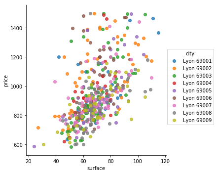
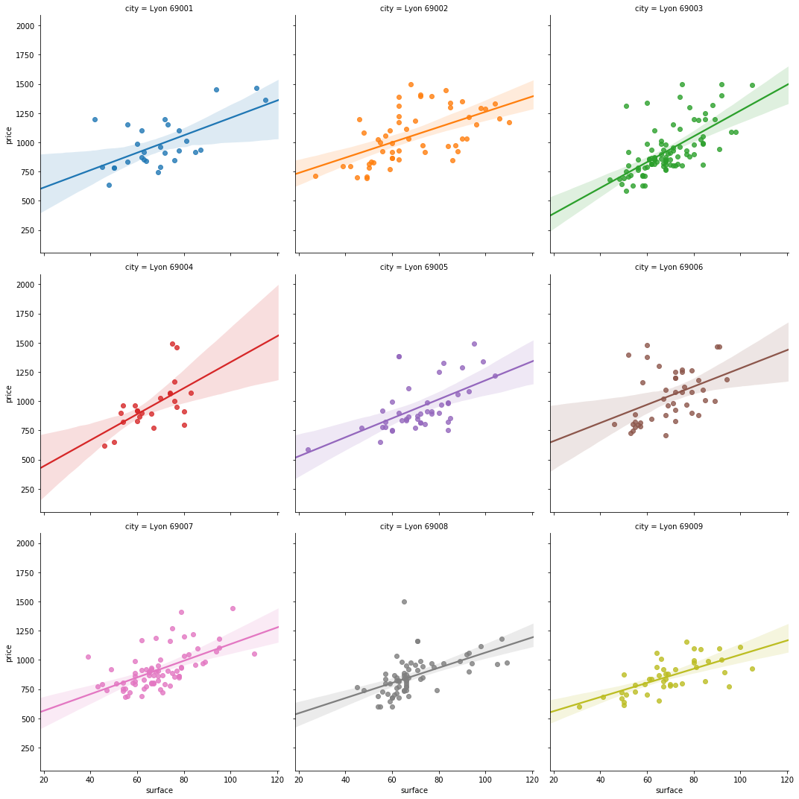
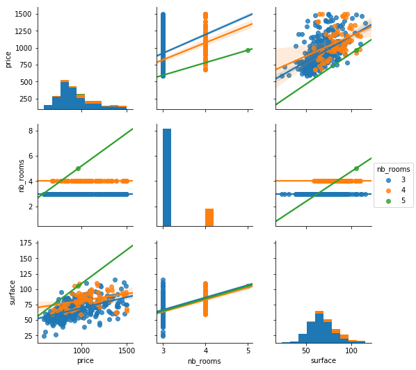

```python
import lb_scrapper as lbs
import pandas as pd
import sqlite3
import seaborn as sns
import matplotlib.pyplot as plt
from IPython.display import display, HTML
```


```python
conn = sqlite3.connect('./datas/scrapped_lbc.db')
df = pd.read_sql_query("select * from Lyon_rent;", conn)
df.columns.tolist()
```


    ['link',
     'title',
     'price',
     'city',
     'nb_rooms',
     'surface',
     'charges',
     'furnished',
     'description',
     'update_date']


```python
df.city=pd.Categorical(df.city, categories=sorted(df.city.unique().tolist()),ordered=True)
```


```python
display(df.describe())
```


<div>
<style scoped>
    .dataframe tbody tr th:only-of-type {
        vertical-align: middle;
    }

    .dataframe tbody tr th {
        vertical-align: top;
    }

    .dataframe thead th {
        text-align: right;
    }
</style>
<table border="1" class="dataframe">
  <thead>
    <tr style="text-align: right;">
      <th></th>
      <th>price</th>
      <th>nb_rooms</th>
      <th>surface</th>
    </tr>
  </thead>
  <tbody>
    <tr>
      <th>count</th>
      <td>500.000000</td>
      <td>500.000000</td>
      <td>500.000000</td>
    </tr>
    <tr>
      <th>mean</th>
      <td>938.948000</td>
      <td>3.150000</td>
      <td>65.048000</td>
    </tr>
    <tr>
      <th>std</th>
      <td>201.238802</td>
      <td>0.362992</td>
      <td>21.379988</td>
    </tr>
    <tr>
      <th>min</th>
      <td>583.000000</td>
      <td>3.000000</td>
      <td>1.000000</td>
    </tr>
    <tr>
      <th>25%</th>
      <td>799.000000</td>
      <td>3.000000</td>
      <td>58.000000</td>
    </tr>
    <tr>
      <th>50%</th>
      <td>891.000000</td>
      <td>3.000000</td>
      <td>66.000000</td>
    </tr>
    <tr>
      <th>75%</th>
      <td>1037.500000</td>
      <td>3.000000</td>
      <td>77.000000</td>
    </tr>
    <tr>
      <th>max</th>
      <td>1500.000000</td>
      <td>5.000000</td>
      <td>115.000000</td>
    </tr>
  </tbody>
</table>
</div>


A lot of observation with surface == 1 appears, which seems to be a wrong value, so we are going to delete them.


```python
df.loc[df.surface == 1,"surface"] = None
```


```python
sns.lmplot(y="price",x='surface', hue="city",data=df,fit_reg=False)
plt.show()
```





```python
sns.lmplot(y="price",x='surface', hue="city", col="city",data=df,col_wrap=3)
plt.show()
```





```python
sns.pairplot(df.dropna(), kind="reg",hue="nb_rooms")
plt.show()
```




