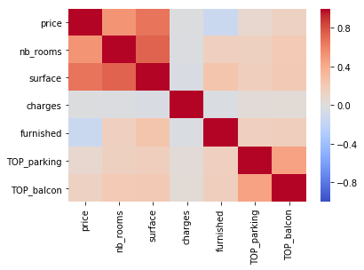
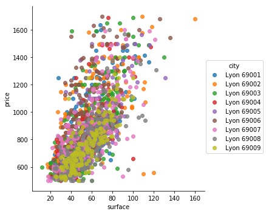
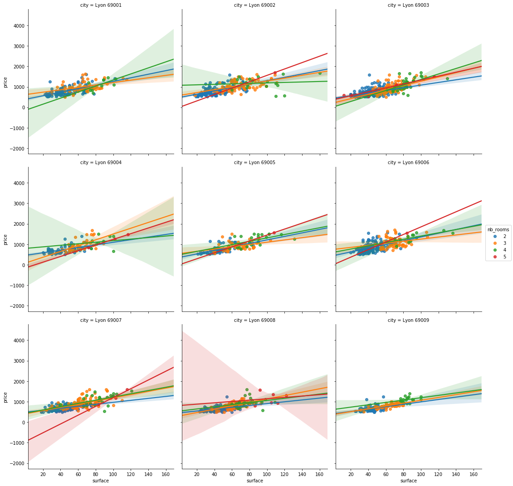
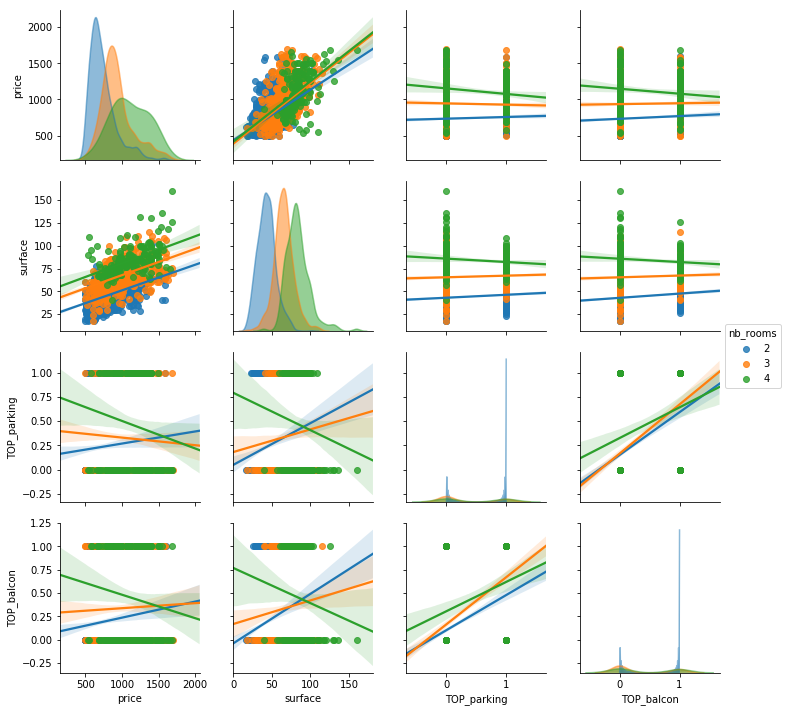
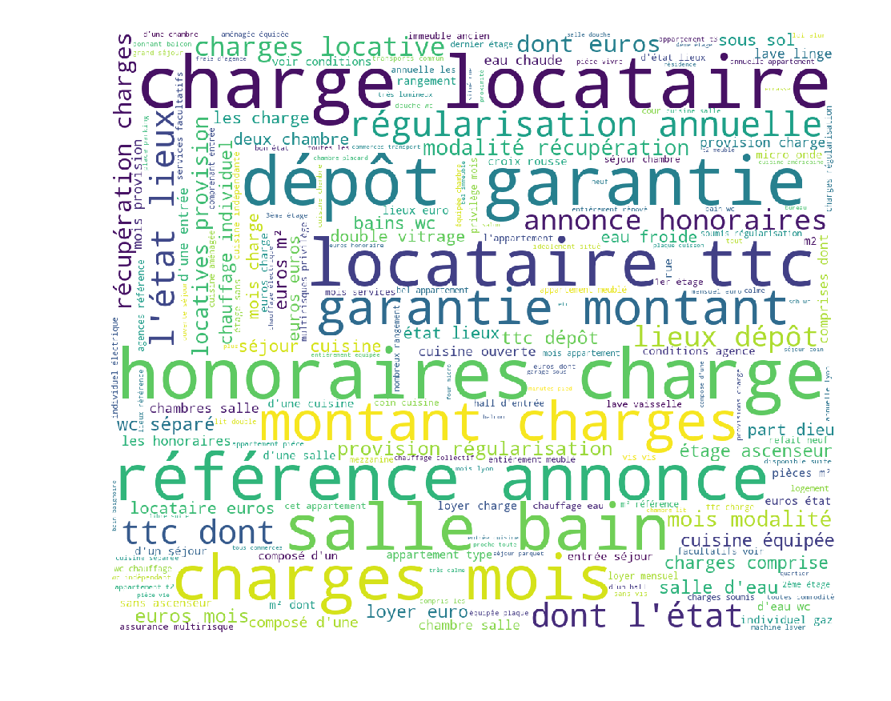

```python
import lb_scrapper as lbs
import pandas as pd
import sqlite3
import seaborn as sns
import matplotlib.pyplot as plt
from IPython.display import display, HTML
import re
import numpy as np
```

# How to use the scrapper
## The scrapper object
The scrapper is a simple class with a few built-in methods. A lot of arguments are optionnal. For complete documentation see the code.


```python
mscrapper = lbs.request_lb(request="", dataname="Lyon_rent")
mscrapper.check_nb_entries()
```

    Currently, 2083 entries.


We can extend the scrapping by calling the `update_db` method.


```python
mscrapper.update_db(nb_iter=20,step=1)
```

    Committing 1 new lines
    [==------------------------------------------------] 5.00%
    Committing 1 new lines
    [=====---------------------------------------------] 10.00%
    Committing 1 new lines
    [=======-------------------------------------------] 15.00%
    Committing 1 new lines
    [==========----------------------------------------] 20.00%
    Committing 1 new lines
    [============--------------------------------------] 25.00%
    Committing 1 new lines
    [===============-----------------------------------] 30.00%
    Committing 1 new lines
    [=================---------------------------------] 35.00%
    Committing 1 new lines
    [====================------------------------------] 40.00%
    Committing 1 new lines
    [======================----------------------------] 45.00%
    Committing 1 new lines
    [=========================-------------------------] 50.00%
    Committing 1 new lines
    [===========================-----------------------] 55.00%
    Committing 1 new lines
    [==============================--------------------] 60.00%
    Committing 1 new lines
    [================================------------------] 65.00%
    Committing 1 new lines
    [===================================---------------] 70.00%
    Committing 1 new lines
    [=====================================-------------] 75.00%
    Committing 1 new lines
    [========================================----------] 80.00%
    Committing 1 new lines
    [==========================================--------] 85.00%
    Committing 1 new lines
    [=============================================-----] 90.00%
    Committing 1 new lines
    [===============================================---] 95.00%
    Committing 1 new lines
    [==================================================] 100.00%
    End of commits


As the results are stored in a SQL database, we can convert it to a dataframe to explore it.


```python
conn = sqlite3.connect('./datas/scrapped_lbc.db')
df = pd.read_sql_query("select * from Lyon_rent;", conn)
df.columns.tolist()
```


    ['link',
     'title',
     'price',
     'city',
     'nb_rooms',
     'surface',
     'charges',
     'furnished',
     'description',
     'update_date']


The columns are the following :
- link: link to the post
- title: title of the post
- price: rent in euro
- city: postcode, gives the area in Lyon
- nb_rooms: number of rooms (living room, bedrooms)
- surface: size in square meter
- charges: are the charges included or not in the price
- furnished: are the furniture included
- description: content of the post (in french)
- update_date: date of collect

## Working with datas

As the datas are raw, we need to clean them a bit and change some things.

### Quick work on the features

First, let's convert the city as an ordered factor, as it is easier to understand.


```python
df.city=pd.Categorical(df.city, categories=sorted(df.city.unique().tolist()),ordered=True)
```

Now let us add two dummy factors, to check if there is a parking slot, or a balcony included.


```python
df['TOP_parking']=df.description.str.contains(re.compile("parking|garage",re.IGNORECASE))
```


```python
df['TOP_balcon']=df.description.str.contains(re.compile("terrasse|balcon",re.IGNORECASE))
```

The bascic stastistics for numerical variables are the following :


```python
df.select_dtypes(include=[np.number,bool]).astype(float).describe()
```


<div>
<style scoped>
    .dataframe tbody tr th:only-of-type {
        vertical-align: middle;
    }

    .dataframe tbody tr th {
        vertical-align: top;
    }

    .dataframe thead th {
        text-align: right;
    }
</style>
<table border="1" class="dataframe">
  <thead>
    <tr style="text-align: right;">
      <th></th>
      <th>price</th>
      <th>nb_rooms</th>
      <th>surface</th>
      <th>TOP_parking</th>
      <th>TOP_balcon</th>
    </tr>
  </thead>
  <tbody>
    <tr>
      <th>count</th>
      <td>2083.000000</td>
      <td>2083.000000</td>
      <td>2083.000000</td>
      <td>2083.000000</td>
      <td>2083.000000</td>
    </tr>
    <tr>
      <th>mean</th>
      <td>850.614018</td>
      <td>2.572732</td>
      <td>54.466155</td>
      <td>0.293327</td>
      <td>0.265963</td>
    </tr>
    <tr>
      <th>std</th>
      <td>245.811946</td>
      <td>0.697784</td>
      <td>20.968440</td>
      <td>0.455396</td>
      <td>0.441950</td>
    </tr>
    <tr>
      <th>min</th>
      <td>500.000000</td>
      <td>2.000000</td>
      <td>1.000000</td>
      <td>0.000000</td>
      <td>0.000000</td>
    </tr>
    <tr>
      <th>25%</th>
      <td>663.000000</td>
      <td>2.000000</td>
      <td>40.000000</td>
      <td>0.000000</td>
      <td>0.000000</td>
    </tr>
    <tr>
      <th>50%</th>
      <td>800.000000</td>
      <td>2.000000</td>
      <td>53.000000</td>
      <td>0.000000</td>
      <td>0.000000</td>
    </tr>
    <tr>
      <th>75%</th>
      <td>965.500000</td>
      <td>3.000000</td>
      <td>68.000000</td>
      <td>1.000000</td>
      <td>1.000000</td>
    </tr>
    <tr>
      <th>max</th>
      <td>1700.000000</td>
      <td>5.000000</td>
      <td>160.000000</td>
      <td>1.000000</td>
      <td>1.000000</td>
    </tr>
  </tbody>
</table>
</div>


As expected, the price goes from 500 to 1500, with a mean of 950, which is slightly higher than the median. The Q1-Q3 interval is approx. 800 to 1000, which means that a lot of prices are in that range.

For our price range, the number of rooms evolve from 3 to 5, but actually most of the offers are for 3 rooms as we can see.

A lot of surfaces values are equal to 1, which is a mistake or a mislead, so we can delete it.


```python
df.loc[df.surface == 1,"surface"] = None
```


```python
df.select_dtypes(include=[np.number,bool]).astype(float).describe()
```


<div>
<style scoped>
    .dataframe tbody tr th:only-of-type {
        vertical-align: middle;
    }

    .dataframe tbody tr th {
        vertical-align: top;
    }

    .dataframe thead th {
        text-align: right;
    }
</style>
<table border="1" class="dataframe">
  <thead>
    <tr style="text-align: right;">
      <th></th>
      <th>price</th>
      <th>nb_rooms</th>
      <th>surface</th>
      <th>TOP_parking</th>
      <th>TOP_balcon</th>
    </tr>
  </thead>
  <tbody>
    <tr>
      <th>count</th>
      <td>2083.000000</td>
      <td>2083.000000</td>
      <td>2026.000000</td>
      <td>2083.000000</td>
      <td>2083.000000</td>
    </tr>
    <tr>
      <th>mean</th>
      <td>850.614018</td>
      <td>2.572732</td>
      <td>55.970385</td>
      <td>0.293327</td>
      <td>0.265963</td>
    </tr>
    <tr>
      <th>std</th>
      <td>245.811946</td>
      <td>0.697784</td>
      <td>19.217767</td>
      <td>0.455396</td>
      <td>0.441950</td>
    </tr>
    <tr>
      <th>min</th>
      <td>500.000000</td>
      <td>2.000000</td>
      <td>12.000000</td>
      <td>0.000000</td>
      <td>0.000000</td>
    </tr>
    <tr>
      <th>25%</th>
      <td>663.000000</td>
      <td>2.000000</td>
      <td>41.000000</td>
      <td>0.000000</td>
      <td>0.000000</td>
    </tr>
    <tr>
      <th>50%</th>
      <td>800.000000</td>
      <td>2.000000</td>
      <td>54.000000</td>
      <td>0.000000</td>
      <td>0.000000</td>
    </tr>
    <tr>
      <th>75%</th>
      <td>965.500000</td>
      <td>3.000000</td>
      <td>68.000000</td>
      <td>1.000000</td>
      <td>1.000000</td>
    </tr>
    <tr>
      <th>max</th>
      <td>1700.000000</td>
      <td>5.000000</td>
      <td>160.000000</td>
      <td>1.000000</td>
      <td>1.000000</td>
    </tr>
  </tbody>
</table>
</div>


The surface goes from 24 to 115, with most of the offers between 60 and 78.

Finally, the parking and balcony are not as seldom as in paris, since a third of the sample seems to have one.

### What does it looks like ?

Let's explore a bit further the variable, to see what we have


```python
from sklearn import preprocessing
le = preprocessing.LabelEncoder()
df2=df.drop(["link","title","description","update_date"],axis=1).copy().dropna()
for x in df2.columns:
    if df2[x].dtypes=='object':
        df2[x]=le.fit_transform(df2[x])

corr = df2.corr()
sns.heatmap(corr, 
            xticklabels=corr.columns.values,
            yticklabels=corr.columns.values,
            cmap="coolwarm",
           vmin = -1, vmax =1)
plt.show()
display(corr)
del df2
```





<div>
<style scoped>
    .dataframe tbody tr th:only-of-type {
        vertical-align: middle;
    }

    .dataframe tbody tr th {
        vertical-align: top;
    }

    .dataframe thead th {
        text-align: right;
    }
</style>
<table border="1" class="dataframe">
  <thead>
    <tr style="text-align: right;">
      <th></th>
      <th>price</th>
      <th>nb_rooms</th>
      <th>surface</th>
      <th>charges</th>
      <th>furnished</th>
      <th>TOP_parking</th>
      <th>TOP_balcon</th>
    </tr>
  </thead>
  <tbody>
    <tr>
      <th>price</th>
      <td>1.000000</td>
      <td>0.526267</td>
      <td>0.667754</td>
      <td>-0.012870</td>
      <td>-0.138983</td>
      <td>0.081107</td>
      <td>0.139116</td>
    </tr>
    <tr>
      <th>nb_rooms</th>
      <td>0.526267</td>
      <td>1.000000</td>
      <td>0.734436</td>
      <td>-0.016719</td>
      <td>0.160314</td>
      <td>0.154765</td>
      <td>0.208522</td>
    </tr>
    <tr>
      <th>surface</th>
      <td>0.667754</td>
      <td>0.734436</td>
      <td>1.000000</td>
      <td>-0.031326</td>
      <td>0.244144</td>
      <td>0.166709</td>
      <td>0.215190</td>
    </tr>
    <tr>
      <th>charges</th>
      <td>-0.012870</td>
      <td>-0.016719</td>
      <td>-0.031326</td>
      <td>1.000000</td>
      <td>-0.026150</td>
      <td>0.037693</td>
      <td>0.046747</td>
    </tr>
    <tr>
      <th>furnished</th>
      <td>-0.138983</td>
      <td>0.160314</td>
      <td>0.244144</td>
      <td>-0.026150</td>
      <td>1.000000</td>
      <td>0.161212</td>
      <td>0.170892</td>
    </tr>
    <tr>
      <th>TOP_parking</th>
      <td>0.081107</td>
      <td>0.154765</td>
      <td>0.166709</td>
      <td>0.037693</td>
      <td>0.161212</td>
      <td>1.000000</td>
      <td>0.454868</td>
    </tr>
    <tr>
      <th>TOP_balcon</th>
      <td>0.139116</td>
      <td>0.208522</td>
      <td>0.215190</td>
      <td>0.046747</td>
      <td>0.170892</td>
      <td>0.454868</td>
      <td>1.000000</td>
    </tr>
  </tbody>
</table>
</div>


The correlation matrix is interesting. It shows us that the greatest positive correlation are Price/Surface and Parking/Balcony. The first one is not so surprising, but the value (approx. 1/2) shows that the link is not totally linear between the two variables.

For the second one, we can conclude that when you have a parking, you are likely to have a balcony. 

We also have a good correlation between surface and number of rooms, which is expected.

Finally the most surprising part is that furnished flats tends to be cheaper than other one. 

The different suburbs of Lyon might also impact the price and surface.


```python
sns.lmplot(y="price",x='surface', hue="city",data=df,fit_reg=False)
plt.show()
```





We saw that the correlation is positive between price and surface. By coloring the point by area we see that some area tends to be more expensive than other, but without separating the graphs it is hard to see.


```python
sns.lmplot(y="price",x='surface', hue="nb_rooms", col="city",data=df,col_wrap=3)
plt.show()
```





```python
sns.pairplot(df[df.nb_rooms != 5].dropna(), kind="reg",hue="nb_rooms",diag_kind="kde",diag_kws=dict(shade=True, alpha = 0.5),
            vars=['price','surface','TOP_parking','TOP_balcon'])
plt.show()
```





Depending on the areas, the slopes are different. It is interesting to see that contrary to the complete scatterplot, here the relationship between price and surface seems to be clearer, with less volatility.

### Words analysis

We have all the descriptions available here, but it is hard to extract feature manually. We are going to use some of NLTK tools to ease the process.


```python
from wordcloud import WordCloud
```


```python
from nltk.corpus import stopwords
import nltk
import string
```


```python
text_desc = ' '.join(df.description)
text_desc = [word for word in nltk.word_tokenize(text_desc) 
             if word.lower() not in stopwords.words('french') and word not in string.punctuation]
```


```python
wordcloud = WordCloud(stopwords=stopwords.words("french"),
                          background_color='white',
                          width=1200,
                          height=1000,
                         ).generate(' '.join(text_desc).lower())

plt.figure(figsize=(6, 4),dpi = 250)
plt.imshow(wordcloud)
plt.axis('off')
plt.show()
```





Most of the words are part of the 


```python
text_dist=nltk.FreqDist(text_desc)
text_dist.most_common(20)
```


    [('€', 5011),
     ('charges', 2929),
     ('mois', 1891),
     ('euros', 1697),
     ('cuisine', 1634),
     ('locataire', 1621),
     ('charge', 1521),
     ('salle', 1491),
     ('dont', 1468),
     ('TTC', 1427),
     ('Honoraires', 1371),
     ('garantie', 1302),
     ('Dépôt', 1258),
     ('lieux', 1212),
     ('Référence', 1164),
     ('annonce', 1163),
     ('séjour', 1132),
     ('2', 1120),
     ('chambre', 1066),
     ("d'une", 1060)]


```python
from nltk.stem.snowball import FrenchStemmer
stemmer = FrenchStemmer()
```


```python
text_stemmed = [stemmer.stem(w) for w in nltk.word_tokenize(text_desc)]
```


    ---------------------------------------------------------------------------

    TypeError                                 Traceback (most recent call last)

    <ipython-input-41-d0955c54c877> in <module>()
    ----> 1 text_stemmed = [stemmer.stem(w) for w in nltk.word_tokenize(text_desc)]
    

    ~/anaconda3/lib/python3.6/site-packages/nltk/tokenize/__init__.py in word_tokenize(text, language, preserve_line)
        126     :type preserver_line: bool
        127     """
    --> 128     sentences = [text] if preserve_line else sent_tokenize(text, language)
        129     return [token for sent in sentences
        130             for token in _treebank_word_tokenizer.tokenize(sent)]


    ~/anaconda3/lib/python3.6/site-packages/nltk/tokenize/__init__.py in sent_tokenize(text, language)
         93     """
         94     tokenizer = load('tokenizers/punkt/{0}.pickle'.format(language))
    ---> 95     return tokenizer.tokenize(text)
         96 
         97 # Standard word tokenizer.


    ~/anaconda3/lib/python3.6/site-packages/nltk/tokenize/punkt.py in tokenize(self, text, realign_boundaries)
       1239         Given a text, returns a list of the sentences in that text.
       1240         """
    -> 1241         return list(self.sentences_from_text(text, realign_boundaries))
       1242 
       1243     def debug_decisions(self, text):


    ~/anaconda3/lib/python3.6/site-packages/nltk/tokenize/punkt.py in sentences_from_text(self, text, realign_boundaries)
       1289         follows the period.
       1290         """
    -> 1291         return [text[s:e] for s, e in self.span_tokenize(text, realign_boundaries)]
       1292 
       1293     def _slices_from_text(self, text):


    ~/anaconda3/lib/python3.6/site-packages/nltk/tokenize/punkt.py in <listcomp>(.0)
       1289         follows the period.
       1290         """
    -> 1291         return [text[s:e] for s, e in self.span_tokenize(text, realign_boundaries)]
       1292 
       1293     def _slices_from_text(self, text):


    ~/anaconda3/lib/python3.6/site-packages/nltk/tokenize/punkt.py in span_tokenize(self, text, realign_boundaries)
       1279         if realign_boundaries:
       1280             slices = self._realign_boundaries(text, slices)
    -> 1281         for sl in slices:
       1282             yield (sl.start, sl.stop)
       1283 


    ~/anaconda3/lib/python3.6/site-packages/nltk/tokenize/punkt.py in _realign_boundaries(self, text, slices)
       1320         """
       1321         realign = 0
    -> 1322         for sl1, sl2 in _pair_iter(slices):
       1323             sl1 = slice(sl1.start + realign, sl1.stop)
       1324             if not sl2:


    ~/anaconda3/lib/python3.6/site-packages/nltk/tokenize/punkt.py in _pair_iter(it)
        311     """
        312     it = iter(it)
    --> 313     prev = next(it)
        314     for el in it:
        315         yield (prev, el)


    ~/anaconda3/lib/python3.6/site-packages/nltk/tokenize/punkt.py in _slices_from_text(self, text)
       1293     def _slices_from_text(self, text):
       1294         last_break = 0
    -> 1295         for match in self._lang_vars.period_context_re().finditer(text):
       1296             context = match.group() + match.group('after_tok')
       1297             if self.text_contains_sentbreak(context):


    TypeError: expected string or bytes-like object


```python
wordcloud = WordCloud(stopwords=stopwords.words("french"),
                          background_color='white',
                          width=1200,
                          height=1000,
                         ).generate(' '.join(text_stemmed))

plt.figure(figsize=(6, 4),dpi = 250)
plt.imshow(wordcloud)
plt.axis('off')
plt.show()
```
